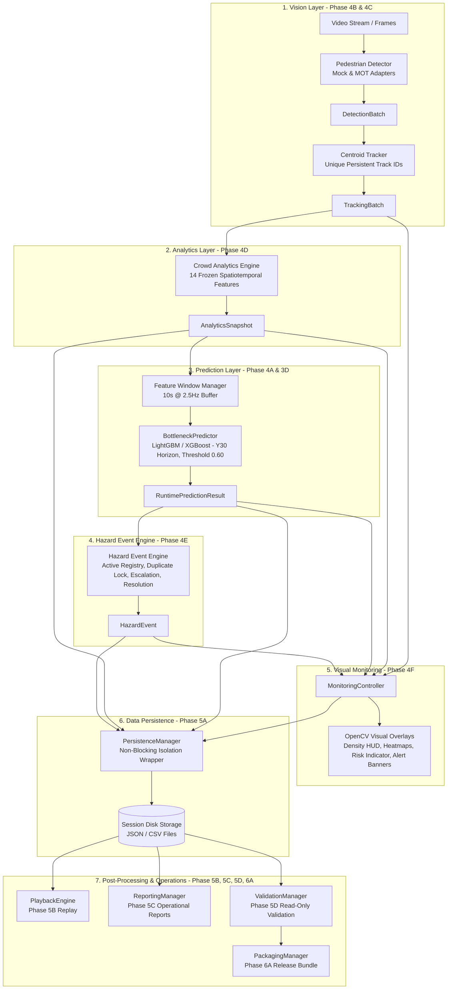
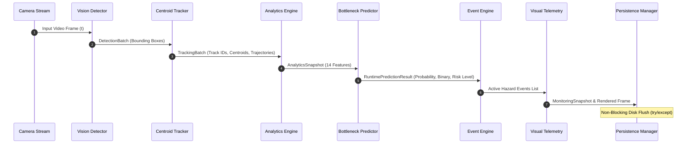

# BHID v1.0 - Architecture & System Design Guide

This document provides a comprehensive technical reference for the architecture, component relationships, data flow pipelines, and design evolution of the **Bottleneck Hazard and Intelligence Detection (BHID)** platform v1.0.

---

## 1. End-to-End System Architecture

BHID is an intelligent spatiotemporal crowd safety platform designed to detect, track, analyze, predict, persist, replay, report, and validate pedestrian bottleneck hazards in high-density public venues (transit hubs, stadiums, concourses, exits).

---

## 2. Package Responsibilities

The BHID codebase is structured into 10 decoupled packages:

| Package | Purpose & Core Responsibility |
|---|---|
| `bhid/vision` | Pedestrian detection interfaces, mock detectors, MOT adapters, and multi-object centroid tracking. |
| `bhid/analytics` | 14 spatiotemporal feature extraction calculators (speed, density, flow, movement, egress deficit). |
| `bhid/prediction` | LightGBM/XGBoost bottleneck risk inference engine ($Y_{30}$ horizon, threshold 0.60). |
| `bhid/events` | Hazard event lifecycle state machine (`ACTIVE`, `ESCALATED`, `RESOLVED`), alert suppression policies. |
| `bhid/visualization` | OpenCV frame rendering, density heatmaps, motion trails, HUD panels, and risk badges. |
| `bhid/persistence` | Non-blocking storage manager, session lifecycles, prediction/analytics/event stores, audit logging. |
| `bhid/replay` | Deterministic historical session replay engine, artifact loaders, and timeline navigation controllers. |
| `bhid/reporting` | Operational KPI engine, chronological trend analyzers, hazard event intelligence, multi-format report exports (JSON, CSV, Markdown). |
| `bhid/validation` | Read-only schema consistency validators, prediction integrity auditors, readiness scoring engine ($\sum w_c S_c$). |
| `bhid/release` | Pre-flight environment validation, startup/shutdown orchestrators, smoke test suites, and release packaging. |

---

## 3. Data Flow & Execution Pipeline

---

## 4. Phase-by-Phase System Evolution Summary

- **Phase 1: Architecture Foundation**: Established repository structure, core contracts, and design guidelines.
- **Phase 2: Dataset & Label Pipeline**: Processed real-world crowd datasets (Madras, SDD, MOT20), generated 14 spatiotemporal features, and established target horizon $Y_{30}$.
- **Phase 3: Model Development & Optimization**: Trained LightGBM and XGBoost models, selecting LightGBM as primary production model ($P \ge 0.60$ threshold).
- **Phase 4A: Feature Windowing & Pipeline Infrastructure**: Implemented 10s @ 2.5Hz sliding feature window manager.
- **Phase 4B: Vision Detection Layer Integration**: Created detector interfaces and adapters.
- **Phase 4C: Multi-Object Tracking Layer**: Created centroid tracker enforcing non-reusable persistent track IDs.
- **Phase 4D: Crowd Analytics Engine**: Created feature calculators for all 14 frozen spatiotemporal features.
- **Phase 4E: Hazard Event Engine**: Created alert policies, duplicate locks per zone, escalation counters, and $N=3$ safe prediction resolution rules.
- **Phase 4F: Visualization Layer**: Created OpenCV telemetry renderers, density heatmaps, motion trails, and alert banners.
- **Phase 5A: Data Persistence Layer**: Created non-blocking exception isolation storage for sessions, predictions, analytics, events, and audit logs.
- **Phase 5B: Historical Playback Engine**: Created deterministic offline replay engine and timeline navigation controller.
- **Phase 5C: Operational Reporting**: Created KPI engines, trend analyzers, hazard intelligence modules, and multi-format report exporters.
- **Phase 5D: Operational Validation**: Created read-only schema validators, prediction auditors, and weighted readiness scoring engine ($\ge 95\%$).
- **Phase 6A: System Packaging & Release**: Created pre-flight environment checks, startup/shutdown orchestrators, smoke test suites, and release manifests.
- **Phase 6B: Documentation & Operational Handover**: Finalized complete operational documentation, architecture references, maintenance runbooks, developer guides, and handover package.
