# BHID v1.0 - Windows One-Click Launcher Guide

This guide provides operational instructions for launching and shutting down the **Bottleneck Hazard and Intelligence Detection (BHID)** platform v1.0 on Windows operating systems using one-click batch scripts.

---

## 1. Quick Start

### Starting the Platform
Double-click `start_bhid.bat` in the project root directory or run from Windows Command Prompt / PowerShell:

```cmd
.\start_bhid.bat
```

What `start_bhid.bat` does automatically:
1. **Python Environment Auto-Detection**: Checks for virtual environment (`venv\Scripts\python.exe`) or defaults to system Python.
2. **Pre-flight Release Verification**: Executes `run_release_verification()` and `validate_launch_environment()`. If verification fails, displays error diagnostic and exits cleanly without launching broken services.
3. **Informational Frontend Check**: Scans workspace for optional web frontends. If absent, logs:
   `[INFO] Frontend: Not Detected (Headless BHID Platform Mode)` and continues seamlessly.
4. **Backend Service Launch**: Opens a dedicated terminal titled `"BHID_BACKEND_SERVICE"` and initializes the runtime orchestrator (`initialize_bhid()`).
5. **Runtime PID File Creation**: Writes active backend process PID to `bhid/data/runtime/bhid.pid`.

---

### Stopping the Platform Gracefully
Double-click `stop_bhid.bat` in the project root directory or run from Windows Command Prompt / PowerShell:

```cmd
.\stop_bhid.bat
```

What `stop_bhid.bat` does automatically:
1. **Graceful Shutdown & Export Flush**: Invokes `shutdown_bhid()`, flushing any pending persistence buffers and closing active recording sessions cleanly.
2. **Clean Window Closure**: Safely closes only the command window titled `"BHID_BACKEND_SERVICE"` using window title matching without killing unrelated Python processes.
3. **Runtime Cleanup**: Removes `bhid/data/runtime/bhid.pid`.

---

## 2. Command Line Interface (CLI) Launcher Controls

Advanced operators can invoke the Python launcher manager directly:

```bash
# Check launch environment & pre-flight release verification
python -m bhid.release.launcher_manager check

# Check optional frontend status (informational)
python -m bhid.release.launcher_manager frontend_check

# Start backend service directly
python -m bhid.release.launcher_manager start

# Stop backend service gracefully
python -m bhid.release.launcher_manager stop

# Regenerate start_bhid.bat and stop_bhid.bat
python -m bhid.release.launcher_manager generate
```

---

## 3. Architecture of the One-Click Launcher

```mermaid
flowchart TD
    subgraph Start [start_bhid.bat]
        S1[Auto-detect Python venv / system] --> S2[Run Pre-flight Release Verification check]
        S2 --> S3[Informational Frontend Check]
        S3 --> S4[Launch Backend Window: BHID_BACKEND_SERVICE]
        S4 --> S5[Write PID to bhid/data/runtime/bhid.pid]
    end

    subgraph Stop [stop_bhid.bat]
        E1[Invoke shutdown_bhid] --> E2[Flush Persistence Buffers & Close Sessions]
        E2 --> E3[Terminate Window title BHID_BACKEND_SERVICE]
        E3 --> E4[Unlink bhid/data/runtime/bhid.pid]
    end
```



---

## 4. Troubleshooting Launcher Issues

| Problem | Cause | Solution |
|---|---|---|
| `[ERROR] Pre-flight release verification failed` | Missing model registry or uninstalled dependencies | Run `pip install -r bhid/requirements.txt` and verify `bhid/models/model_registry.json` exists. |
| `python.exe is not recognized` | Python not added to system PATH | Install Python 3.9-3.12 and check "Add Python to PATH" during installation, or create `venv` in project root (`python -m venv venv`). |
| Process window doesn't close | Permission restriction on `taskkill` | Run `stop_bhid.bat` as Administrator or press `Ctrl+C` in the backend terminal window. |
