# Phase 4A: BHID Runtime Pipeline Architecture & Orchestration Specification

## Executive Summary

Phase 4A establishes the production runtime architecture for the **Bottleneck Hazard and Intelligence Detection (BHID)** system. It bridges upstream vision/crowd analytics data streams to the trained Phase 3D bottleneck prediction engine (`BottleneckPredictor`), providing deterministic temporal window management, centralized runtime state tracking, prediction payload contracts, error handling, and orchestration scaffolding.

---

## System Boundaries & Frozen Constraints

> [!IMPORTANT]
> **Frozen System Assumptions:**
> 1. **Dataset Generation & Features:** The 14 approved spatiotemporal features are frozen (`feature_pedestrian_count`, `feature_density_ped_per_m2`, `feature_occupancy_ratio`, `feature_mean_speed_m_s`, `feature_velocity_variance`, `feature_acceleration_m_s2`, `feature_directional_entropy`, `feature_inflow_rate_per_s`, `feature_outflow_rate_per_s`, `feature_net_flow_rate_per_s`, `feature_egress_deficit_ratio`, `feature_trajectory_convergence`, `feature_temporal_density_change`, `feature_temporal_speed_change`).
> 2. **Target Horizon & Model:** Target prediction horizon is frozen at **Y30** (30-second lead time prediction). The production model artifact (`lightgbm_optimized.joblib`) and decision boundary threshold (**0.60**) defined in `model_registry.json` are frozen.
> 3. **No Retraining or UI Infrastructure:** Phase 4A does NOT retrain or alter any machine learning model, nor does it introduce web APIs, dashboards, or deployment infrastructure.

---

## End-to-End Runtime Pipeline Architecture

The BHID runtime architecture processes incoming crowd analytics snapshots through a clean modular pipeline:

```mermaid
flowchart LR
    VS[Video Stream] --> DET[Detector\nPhase 4B]
    DET --> TRK[Tracker\nPhase 4C]
    TRK --> ANA[Crowd Analytics\nPhase 4D]
    ANA --> FWM[Feature Window Buffer\n10s @ 2.5Hz / 25 samples]
    FWM --> RPR[Prediction Request]
    RPR --> BPE[Bottleneck Predictor\nPhase 3D LightGBM Engine]
    BPE --> RES[Prediction Result\nProbability / Binary / Risk Level]
    RES --> PCTX[Pipeline Context Update\nState Tracking]
    PCTX --> EVT[Event Output\nPhase 4E Alerts]
```



---

## Detailed Package Structure & Components

The runtime package is located at `bhid/runtime/` with the following structure:

```text
bhid/runtime/
├── __init__.py
├── exceptions.py
├── feature_schema.py
├── feature_window_manager.py
├── pipeline_context.py
├── runtime_prediction_request.py
├── runtime_prediction_result.py
└── runtime_orchestrator.py
```

### Component Roles & Responsibilities

1. **`bhid.runtime.exceptions` (`exceptions.py`)**
   - Base exception `RuntimePipelineError`.
   - `FeatureValidationError`: Raised when input features fail schema validation or contain NaN/Inf/missing values.
   - `WindowNotReadyError`: Raised when attempting window operations on an unpopulated buffer.
   - `PredictionError`: Raised when the underlying Phase 3D inference engine encounters an execution error.

2. **`bhid.runtime.feature_schema` (`feature_schema.py`)**
   - Single source of truth for the 14 frozen spatiotemporal features.
   - Maps plain/short names (e.g. `pedestrian_count`) to canonical model names (`feature_pedestrian_count`).
   - Provides validation helpers (`validate_feature_dict`, `normalize_feature_dict`) guaranteeing strict type and boundary checking.

3. **`bhid.runtime.feature_window_manager` (`feature_window_manager.py`)**
   - **Pure Temporal Rolling Buffer**: Strictly responsible for buffer management without mixing feature calculation logic.
   - Configured for a **10-second observation window** at a **2.5Hz update cadence** (retaining up to **25 samples max**).
   - Automatically purges expired samples older than 10.0 seconds relative to the latest timestamp.
   - Enforces strict non-decreasing chronological ordering to prevent future data leakage.

4. **`bhid.runtime.pipeline_context` (`pipeline_context.py`)**
   - Centralized state container managing runtime status across active scenes and spatial ROI zones.
   - Tracks `current_timestamp`, `active_scene`, `active_zone`, `feature_buffer`, `prediction_results` history, `bottleneck_state` ("LOW", "MODERATE", "HIGH", "CRITICAL"), and `is_bottleneck_active` flag.

5. **`bhid.runtime.runtime_prediction_request` (`runtime_prediction_request.py`)**
   - Structured input payload containing `scene_id`, `zone_id`, `timestamp`, and the validated 14 feature vector.
   - Methods: `to_model_dict()`, `to_dataframe()`, and `validate()`.

6. **`bhid.runtime.runtime_prediction_result` (`runtime_prediction_result.py`)**
   - Structured output schema encapsulating inference outputs: `prediction_probability`, `binary_prediction`, `risk_level`, `threshold_used` (0.60), `target_horizon` ("Y30"), `timestamp`, `scene_id`, and `zone_id`.
   - Factory constructor: `from_inference_output()`.

7. **`bhid.runtime.runtime_orchestrator` (`runtime_orchestrator.py`)**
   - Main workflow coordinator linking feature snapshots, window manager updates, request creation, model execution, state context tracking, and result emission.
   - Supports processing synthetic feature streams via `process_synthetic_stream()` for offline validation.

---

## Verification & Test Architecture

Phase 4A is fully validated via automated unit and integration tests:

### Unit Tests
- **`bhid/tests/unit/test_runtime_window_manager.py`**: Validates rolling capacity (exact 25-sample retention), time-based sample purging, chronological ordering, and pure buffer behavior.
- **`bhid/tests/unit/test_runtime_orchestrator.py`**: Validates single snapshot processing, risk classification, context state updates, and schema error handling.

### Integration Test
- **`bhid/tests/integration/test_runtime_pipeline.py`**: End-to-end integration test validating stream processing through the full pipeline:
  Synthetic Stream → Window Buffer → Prediction Request → Predictor → Prediction Result → Pipeline Context Update.

---

## Roadmap to Future Phases

The Phase 4A runtime architecture establishes the foundational backbone for subsequent implementation phases:

- **Phase 4B (Detection Integration):** Connect vision object detector models (YOLOv8/RF-CN) to stream bounding boxes into the pipeline.
- **Phase 4C (Tracking Integration):** Integrate multi-object tracking algorithms (ByteTrack/DeepSORT) for persistent trajectory ID association.
- **Phase 4D (Live Feature Extraction):** Feed frame-by-frame tracker outputs into the crowd analytics module to generate live 14-feature snapshots.
- **Phase 4E (Real-Time Prediction & Alerting):** Connect prediction results to real-time risk assessment and automated hazard alert generation.
