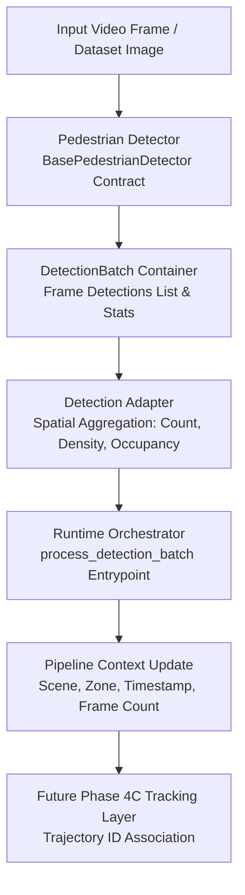

# Phase 4B: BHID Detection Integration Layer Specification

## Executive Summary

Phase 4B introduces the pedestrian detection integration layer into the BHID runtime architecture established in Phase 4A. It defines canonical single-object detection schemas (`Detection`), frame-level detection batch containers (`DetectionBatch`), an abstract detector contract (`BasePedestrianDetector`), a deterministic mock detector implementation (`MockPedestrianDetector`), and a detection-to-observation adapter (`DetectionAdapter`).

---

## System Boundaries & Frozen Constraints

> [!IMPORTANT]
> **Frozen System Constraints:**
> 1. **No Tracking Implementation:** Tracking algorithms (ByteTrack/DeepSORT) and persistent trajectory ID association are postponed to Phase 4C.
> 2. **No Feature Engineering Leakage:** The detection layer does NOT compute Phase 2 temporal engineered features (e.g. directional entropy, egress deficit ratio, temporal speed/density change).
> 3. **No Model Retraining:** Detector model weights and Phase 3D prediction models remain frozen.
> 4. **Runtime Pipeline Continuity:** Clean integration with Phase 4A `RuntimeOrchestrator` without breaking existing prediction pipelines.

---

## Detection Pipeline Architecture

---

## Detailed Component Specifications

### 1. Detection Schema (`bhid/vision/detection/detection_schema.py`)
- Dataclass `Detection`:
  - `detection_id`: Unique identifier string.
  - `class_name`: Object category label (default: `'pedestrian'`).
  - `confidence`: Confidence probability score in `[0.0, 1.0]`.
  - `bbox_x1`, `bbox_y1`, `bbox_x2`, `bbox_y2`: Bounding box pixel/normalized coordinates.
  - `frame_id`, `timestamp`: Temporal metadata.
- Validation: Checks `0.0 <= confidence <= 1.0`, `bbox_x1 <= bbox_x2`, and `bbox_y1 <= bbox_y2`.
- Computed properties: `width`, `height`, `area`, `center`.

### 2. Detection Batch Container (`bhid/vision/detection/detection_batch.py`)
- Container `DetectionBatch`:
  - Stores all bounding box detections for a single frame.
  - `pedestrian_count(confidence_threshold)`: Filters and counts pedestrians.
  - `confidence_summary()`: Returns mean, min, max, std, and total count.
  - `filter_by_confidence(min_confidence)`: Returns filtered `DetectionBatch`.
  - `get_bboxes()`: Returns coordinate tuples.

### 3. Pedestrian Detector Contract (`bhid/vision/detection/pedestrian_detector_interface.py`)
- Abstract base class `BasePedestrianDetector`:
  - `initialize(config)`: Loads model weights/device context.
  - `detect(frame, frame_id, timestamp) -> DetectionBatch`: Executes inference.
  - `shutdown()`: Cleans up device resources.

### 4. Synthetic Mock Detector (`bhid/vision/detection/mock_detector.py`)
- Class `MockPedestrianDetector`:
  - Inherits from `BasePedestrianDetector`.
  - Generates deterministic bounding boxes per frame for unit and integration testing.

### 5. Detection Adapter (`bhid/vision/detection/detection_adapter.py`)
- Class `DetectionAdapter`:
  - Transforms raw `DetectionBatch` into structured detection observations (`pedestrian_count`, `density_ped_per_m2`, `occupancy_ratio`, `mean_confidence`).
  - Computes spatial density relative to spatial ROI zone area.

### 6. Runtime Orchestrator Entrypoint (`bhid/runtime/runtime_orchestrator.py`)
- Method `process_detection_batch()`:
  - Ingests `DetectionBatch` via `DetectionAdapter`.
  - Updates location context (`active_scene`, `active_zone`), current timestamp, and processed frame counter.

---

## Verification & Test Architecture

Phase 4B is verified through comprehensive targeted unit and integration tests:

1. **`bhid/tests/unit/test_detection_schema.py`**: Validates schema geometry, confidence boundaries, and dictionary serialization.
2. **`bhid/tests/unit/test_detection_batch.py`**: Validates pedestrian filtering, confidence statistics summary, and thresholding.
3. **`bhid/tests/unit/test_mock_detector.py`**: Validates mock detector lifecycle, deterministic reproducibility, and count configuration.
4. **`bhid/tests/integration/test_detection_runtime_integration.py`**: Validates full pipeline flow from mock detector to runtime orchestrator.

---

## Phase 4C Tracking Layer Handoff Contract

In Phase 4C, persistent pedestrian tracking algorithms (ByteTrack/DeepSORT) will consume `DetectionBatch` outputs, associate bounding boxes across consecutive frames, assign persistent `track_id` labels, and compute individual movement trajectories for Phase 4D live crowd feature extraction.
