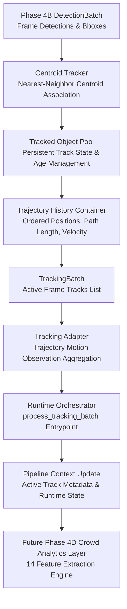
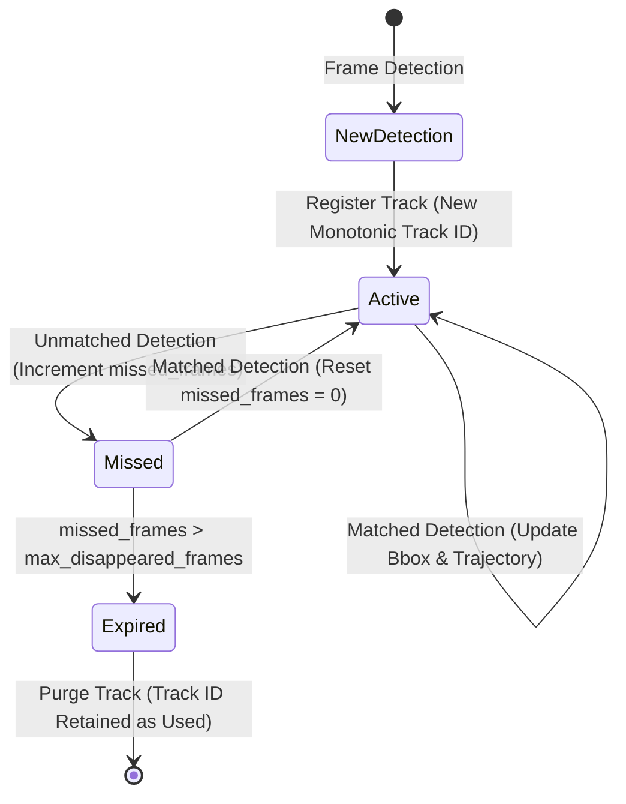

# Phase 4C: BHID Multi-Object Tracking Layer Specification

## Executive Summary

Phase 4C introduces the multi-object tracking (MOT) layer into the BHID vision pipeline. Positioned between the Phase 4B vision detection layer and the Phase 4A runtime architecture, it transforms frame-level detection bounding boxes into persistent pedestrian trajectories with non-reusable unique track IDs.

---

## System Boundaries & Frozen Constraints

> [!IMPORTANT]
> **Frozen System Constraints:**
> 1. **Independent Tracking Layer:** Multi-object tracking functions independently from prediction model weights.
> 2. **No Feature Engineering Leakage:** The tracking layer does NOT compute final Phase 2 engineered spatiotemporal features (e.g. egress deficit ratio, directional entropy). Feature extraction is postponed to Phase 4D.
> 3. **Non-Reusable Track IDs:** `track_id` values increment monotonically across the entire session and are NEVER reused after track expiration.
> 4. **No UI or Infrastructure:** No dashboard, deployment infrastructure, or live camera integrations are introduced in Phase 4C.

---

## Tracking Pipeline Architecture

---

## Detailed Component Specifications

### 1. Trajectory Model (`bhid/vision/tracking/trajectory.py`)
- Dataclass `TrajectoryPoint`: Captures `x`, `y`, `timestamp`, and `frame_id`.
- Class `Trajectory`:
  - Maintains ordered sequence of spatial points up to `max_history_points` (default: 500).
  - `duration_seconds()`: Returns temporal span from start to end point.
  - `get_path_length()`: Calculates cumulative Euclidean distance across points.
  - `get_average_velocity()`: Computes `(vx, vy)` velocity vector in units/second.

### 2. Tracked Object Model (`bhid/vision/tracking/tracked_object.py`)
- Class `TrackedObject`:
  - `track_id`: Unique track identifier.
  - `current_bbox`: Latest `(x1, y1, x2, y2)` coordinates.
  - `age_frames`: Number of frames since initial track creation.
  - `missed_frames`: Consecutive frames missed without detection match.
  - `trajectory_history`: Instance of `Trajectory`.
  - Methods: `update(bbox, confidence, timestamp, frame_id)`, `mark_missed()`, `get_center()`, `get_velocity_estimate()`.

### 3. Pedestrian Tracker Interface (`bhid/vision/tracking/tracker_interface.py`)
- Abstract base class `BasePedestrianTracker`:
  - `initialize(config)`: Configures thresholds.
  - `update(detection_batch) -> TrackingBatch`: Ingests frame detections and updates track state.
  - `reset()`: Resets track storage.
  - `shutdown()`: Cleans up resources.

### 4. Baseline Centroid Tracker (`bhid/vision/tracking/centroid_tracker.py`)
- Class `CentroidTracker`:
  - Implements nearest-neighbor Euclidean distance association between active track centroids and detection centroids.
  - Configurable `max_disappeared_frames` (default: 10) and `max_match_distance` (default: 100.0 px).
  - **Strict Track ID Policy**: Track IDs increment monotonically (`_next_track_id`) and are NEVER reused when tracks expire.

### 5. Tracking Batch Container (`bhid/vision/tracking/tracking_batch.py`)
- Class `TrackingBatch`:
  - Encapsulates active tracks for a single frame.
  - Methods: `active_count()`, `get_track_ids()`, `get_bboxes()`, `get_centroids()`.

### 6. Tracking Adapter (`bhid/vision/tracking/tracking_adapter.py`)
- Class `TrackingAdapter`:
  - Transforms `TrackingBatch` outputs into standardized trajectory observations (`active_track_count`, `track_ids`, `mean_speed_m_s`, `mean_path_length_px`).

### 7. Runtime Orchestrator Entrypoint (`bhid/runtime/runtime_orchestrator.py`)
- Method `process_tracking_batch()`:
  - Ingests `TrackingBatch` via `TrackingAdapter`.
  - Updates active location context and frame metadata in `PipelineContext`.

---

## Track Lifecycle State Machine

---

## Verification & Test Strategy

Phase 4C is fully verified through targeted unit and integration tests:

1. **`bhid/tests/unit/test_trajectory.py`**: Validates point accumulation, path length computation, velocity estimation, and point pruning.
2. **`bhid/tests/unit/test_tracked_object.py`**: Validates track state creation, center calculation, update logic, and missed-frame marking.
3. **`bhid/tests/unit/test_centroid_tracker.py`**: Validates track creation, centroid matching, track expiration, and **track ID non-reuse**.
4. **`bhid/tests/integration/test_tracking_runtime_integration.py`**: Validates end-to-end data flow:
   `Mock Detector → Centroid Tracker → Tracking Batch → Tracking Adapter → Runtime Orchestrator`.

---

## Handoff Contract to Phase 4D

In Phase 4D, the persistent trajectories generated by the Phase 4C tracking layer will feed directly into the **Crowd Analytics Layer** to compute the 14 approved spatiotemporal features (`pedestrian_count`, `density_ped_per_m2`, `occupancy_ratio`, `mean_speed_m_s`, `velocity_variance`, `acceleration_m_s2`, `directional_entropy`, `inflow_rate_per_s`, `outflow_rate_per_s`, `net_flow_rate_per_s`, `egress_deficit_ratio`, `trajectory_convergence`, `temporal_density_change`, `temporal_speed_change`) for live bottleneck prediction.
