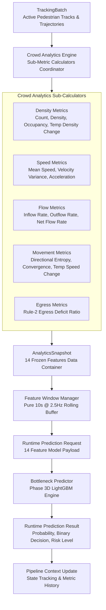

# Phase 4D: BHID Crowd Analytics & Runtime Feature Generation Specification

## Executive Summary

Phase 4D completes the intelligence pipeline of the **Bottleneck Hazard and Intelligence Detection (BHID)** system. It transforms multi-object tracking trajectories (`TrackingBatch`) generated in Phase 4C into the exact 14-feature spatiotemporal analytics vector required by the Phase 3D LightGBM prediction engine (`BottleneckPredictor`).

---

## System Boundaries & Frozen Constraints

> [!IMPORTANT]
> **Frozen System Constraints:**
> 1. **Frozen Feature Schema:** All 14 feature definitions and canonical naming conventions (`feature_*`) are frozen from Phase 2/3.
> 2. **No Model Retraining:** Production LightGBM artifact (`lightgbm_optimized.joblib`), model registry metadata (`model_registry.json`), target horizon (**Y30**), and decision threshold (**0.60**) remain strictly frozen.
> 3. **Frozen Egress Deficit Definition:** Rule-2 egress deficit formula $$R_{egress} = 1 - \frac{Q_{out}}{Q_{in}}$$ when $$Q_{in} > 0$$ (else $$0.0$$) is frozen.
> 4. **No Deployment Infrastructure:** No APIs, web dashboards, or live camera integrations are introduced in Phase 4D.

---

## End-to-End Analytics Architecture

---

## Mathematical Definitions of the 14 Frozen Features

| # | Canonical Feature Name | Mathematical Definition / Formula | Units |
|---|---|---|---|
| 1 | `feature_pedestrian_count` | $$N = \| \{\text{active tracks in zone}\} \|$$ | Pedestrians |
| 2 | `feature_density_ped_per_m2` | $$\rho = \frac{N}{A_{zone}}$$ | Pedestrians / $$m^2$$ |
| 3 | `feature_occupancy_ratio` | $$\mathcal{O} = \min\left(1.0, \frac{\sum \text{Area}(bbox_i)}{A_{zone} \cdot C}\right)$$ | Ratio [0, 1] |
| 4 | `feature_mean_speed_m_s` | $$\bar{v} = \frac{1}{N} \sum_{i=1}^N \|v_i\|$$ | m/s |
| 5 | `feature_velocity_variance` | $$\sigma_v^2 = \frac{1}{N} \sum_{i=1}^N (\|v_i\| - \bar{v})^2$$ | $$(m/s)^2$$ |
| 6 | `feature_acceleration_m_s2` | $$a = \frac{\bar{v}_t - \bar{v}_{t-1}}{\Delta t}$$ | $$m/s^2$$ |
| 7 | `feature_directional_entropy` | $$H = -\sum_{k=1}^8 p_k \log_2(p_k), \quad p_k = \frac{n_k}{N}$$ | Bits [0, 3] |
| 8 | `feature_inflow_rate_per_s` | $$Q_{in} = \frac{N_{new}}{\Delta t}$$ | Pedestrians / s |
| 9 | `feature_outflow_rate_per_s` | $$Q_{out} = \frac{N_{exit}}{\Delta t}$$ | Pedestrians / s |
| 10 | `feature_net_flow_rate_per_s` | $$Q_{net} = Q_{in} - Q_{out}$$ | Pedestrians / s |
| 11 | `feature_egress_deficit_ratio` | $$R_{egress} = \max\left(0, \min\left(1, 1 - \frac{Q_{out}}{Q_{in}}\right)\right) \quad (Q_{in} > 0)$$ | Ratio [0, 1] |
| 12 | `feature_trajectory_convergence` | $$C_{traj} = \frac{\|\sum \vec{v}_i\|}{\sum \|\vec{v}_i\| + \epsilon}$$ | Ratio [0, 1] |
| 13 | `feature_temporal_density_change` | $$\Delta \rho = \frac{\rho_t - \rho_{t-1}}{\Delta t}$$ | Pedestrians / $$m^2 \cdot s$$ |
| 14 | `feature_temporal_speed_change` | $$\Delta v = \frac{\bar{v}_t - \bar{v}_{t-1}}{\Delta t}$$ | $$m/s^2$$ |

---

## Detailed Component Specifications

### 1. `bhid/analytics/speed_metrics.py` (`SpeedMetricsCalculator`)
- Computes `mean_speed_m_s`, `velocity_variance`, and `acceleration_m_s2`.

### 2. `bhid/analytics/flow_metrics.py` (`FlowMetricsCalculator`)
- Computes `inflow_rate_per_s`, `outflow_rate_per_s`, and `net_flow_rate_per_s` by tracking entry/exit events between consecutive frames.

### 3. `bhid/analytics/density_metrics.py` (`DensityMetricsCalculator`)
- Computes `pedestrian_count`, `density_ped_per_m2`, `occupancy_ratio`, and `temporal_density_change`.

### 4. `bhid/analytics/movement_metrics.py` (`MovementMetricsCalculator`)
- Computes `directional_entropy` using 8 uniform angular bins across $[-\pi, \pi]$, `trajectory_convergence`, and `temporal_speed_change`.

### 5. `bhid/analytics/egress_metrics.py` (`EgressMetricsCalculator`)
- Computes `egress_deficit_ratio` using frozen Rule-2 formula $$R_{egress} = 1.0 - (Q_{out} / Q_{in})$$.

### 6. `bhid/analytics/analytics_snapshot.py` (`AnalyticsSnapshot`)
- Dataclass container holding all 14 features, frame ID, timestamp, scene ID, and zone ID.
- `export_feature_vector()`: Exports canonical dictionary with `feature_*` keys matching model schema.

### 7. `bhid/analytics/crowd_analytics_engine.py` (`CrowdAnalyticsEngine`)
- Primary coordinator executing all calculators, maintaining inter-frame tracking memory (`_prev_track_ids`, `_prev_mean_speed_m_s`, `_prev_density_ped_per_m2`, `_prev_timestamp`), and returning `AnalyticsSnapshot`.

### 8. `bhid/runtime/runtime_orchestrator.py`
- Method `process_tracking_batch_with_analytics()`:
  - Connects `TrackingBatch → CrowdAnalyticsEngine → FeatureWindowManager → BottleneckPredictor → RuntimePredictionResult → PipelineContext`.

---

## Verification & Test Architecture

Phase 4D is fully verified through 5 targeted unit test modules and 1 end-to-end integration test module:

1. **`bhid/tests/unit/test_speed_metrics.py`**: Validates mean speed, velocity variance, and acceleration calculations.
2. **`bhid/tests/unit/test_flow_metrics.py`**: Validates inflow, outflow, and net flow rate calculations.
3. **`bhid/tests/unit/test_density_metrics.py`**: Validates pedestrian count, spatial density, occupancy, and temporal density changes.
4. **`bhid/tests/unit/test_movement_metrics.py`**: Validates 8-bin directional entropy, trajectory convergence, and temporal speed changes.
5. **`bhid/tests/unit/test_analytics_engine.py`**: Validates 14-feature snapshot generation, schema validation, and engine reset behavior.
6. **`bhid/tests/integration/test_analytics_runtime_integration.py`**: Validates end-to-end data flow:
   `Detector → Tracker → Analytics Engine → Feature Buffer → Bottleneck Predictor → Prediction Result`.

---

## Roadmap to Phase 4E

With Phase 4D complete, BHID possesses a fully functioning real-time intelligence pipeline that converts vision streams into bottleneck risk predictions. Phase 4E will establish automated risk assessment event dispatch, hazard alert thresholds, and alert event publication.
