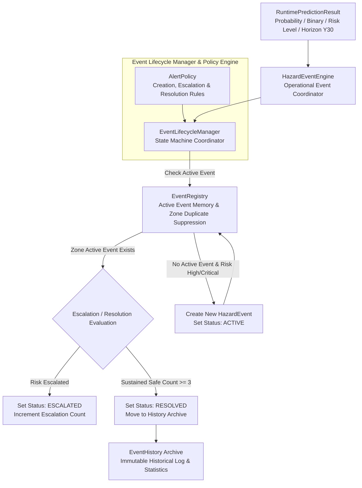
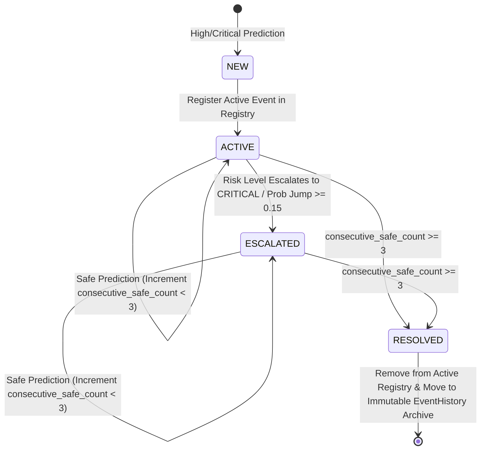

# Phase 4E: BHID Hazard Event Engine & Alert Lifecycle Management Specification

## Executive Summary

Phase 4E completes the operational runtime layer of the **Bottleneck Hazard and Intelligence Detection (BHID)** system. It transforms raw prediction probabilities (`RuntimePredictionResult`) into persistent operational hazard events (`HazardEvent`) with state lifecycle management, zone-level duplicate alert suppression, escalation policies, sustained safe condition resolution rules, and an immutable historical event archive (`EventHistory`).

---

## System Boundaries & Frozen Constraints

> [!IMPORTANT]
> **Frozen System Constraints:**
> 1. **Pure Operational Event Management:** Operates strictly on `RuntimePredictionResult` outputs emitted by the Phase 3D `BottleneckPredictor`.
> 2. **No Model or Threshold Modifications:** Prediction model weights, model registry metadata (`model_registry.json`), decision threshold (**0.60**), and target horizon (**Y30**) remain strictly frozen.
> 3. **No Downstream UI/API Dependencies:** No web APIs, dashboards, or deployment infrastructure are introduced in Phase 4E.
> 4. **No Feature Engineering or Predictor Bypassing:** The entire pipeline remains strictly sequential: `Detection → Tracking → Analytics → Feature Window Buffer → Predictor → Event Engine → Hazard Event`. Nothing bypasses the predictor.

---

## Operational Event Engine Architecture

---

## Event Lifecycle State Machine

---

## Detailed Component Specifications

### 1. Hazard Event Schema (`bhid/events/hazard_event.py`)
- Dataclass `HazardEvent`:
  - `event_id`: Unique identifier string (e.g., `HAZARD_SCENE_ZONE_TIMESTAMP`).
  - `scene_id`, `zone_id`: Spatial location identifiers.
  - `start_timestamp`, `last_updated_timestamp`, `resolved_timestamp`: Temporal tracking.
  - `prediction_probability`, `risk_level`: Latest risk assessment values.
  - `status`: Lifecycle state (`ACTIVE`, `ESCALATED`, `RESOLVED`).
  - `escalation_count`: Total escalation transitions.
  - `prediction_history`: Chronological audit log of all predictions during event lifetime.
  - `duration_seconds()`: Returns duration from start to resolution/update.

### 2. Alert Policy (`bhid/events/alert_policy.py`)
- Class `AlertPolicy`:
  - `should_create_event(result)`: Returns `True` if `binary_prediction == 1` or `risk_level in ["HIGH", "CRITICAL"]`.
  - `should_escalate_event(event, result)`: Returns `True` if transition to `CRITICAL` or probability increases by $\ge 0.15$.
  - `should_resolve_event(event, safe_count)`: Returns `True` ONLY when `safe_count >= safe_resolution_threshold` (default: 3).

### 3. Active Event Registry (`bhid/events/event_registry.py`)
- Class `EventRegistry`:
  - Maintains active events keyed by `event_id` and spatial location `(scene_id, zone_id)`.
  - `get_active_event_for_zone(scene_id, zone_id)`: Enforces zone-level duplicate alert suppression (prevents creating multiple active events for the same zone).

### 4. Immutable Event History (`bhid/events/event_history.py`)
- Class `EventHistory`:
  - Archives deep copies of resolved events immutably.
  - `event_statistics()`: Computes operational summary metrics (`total_events`, `resolved_events`, `average_duration_seconds`, `total_escalations`, `max_probability_observed`).

### 5. Lifecycle Manager (`bhid/events/event_lifecycle_manager.py`)
- Class `EventLifecycleManager`:
  - Coordinates state transitions, safe counter tracking (`_consecutive_safe_counts`), and registry/history updates.

### 6. Event Engine Coordinator (`bhid/events/event_engine.py`)
- Class `HazardEventEngine`:
  - Primary coordinator exposing `process_prediction()`, `get_active_events()`, `get_event_history()`, `generate_summary()`, and `reset()`.

### 7. Runtime Orchestrator Entrypoint (`bhid/runtime/runtime_orchestrator.py`)
- Method `process_prediction_event()`:
  - Executes full pipeline: `TrackingBatch → CrowdAnalyticsEngine → FeatureWindowManager → BottleneckPredictor → RuntimePredictionResult → HazardEventEngine → HazardEvent`.

---

## Verification & Test Architecture

Phase 4E is verified through 5 targeted unit test modules and 1 full pipeline integration test module:

1. **`bhid/tests/unit/test_hazard_event.py`**: Validates event creation, duration calculation, updates, escalation, and resolution.
2. **`bhid/tests/unit/test_alert_policy.py`**: Validates creation, escalation, and safe resolution threshold rules.
3. **`bhid/tests/unit/test_event_registry.py`**: Validates active registration, zone lookup, and duplicate alert suppression.
4. **`bhid/tests/unit/test_event_lifecycle_manager.py`**: Validates state machine transitions and sustained safe resolution.
5. **`bhid/tests/unit/test_event_engine.py`**: Validates event engine coordination, summary generation, and reset capabilities.
6. **`bhid/tests/integration/test_event_pipeline_integration.py`**: Validates full operational execution across all BHID phases (4A - 4E):
   `Detector → Tracker → Analytics → Feature Buffer → Predictor → Event Engine`.

---

## Operational Handoff Summary

With Phase 4E complete, the BHID core runtime engine provides a complete end-to-end intelligence architecture:
$$\text{Video Frame} \longrightarrow \text{Detection} \longrightarrow \text{Tracking} \longrightarrow \text{Analytics} \longrightarrow \text{Prediction} \longrightarrow \text{Hazard Event}$$
Active hazard events and historical archives are structured, validated, and ready for integration with real-world crowd management control systems and emergency dispatch interfaces.
