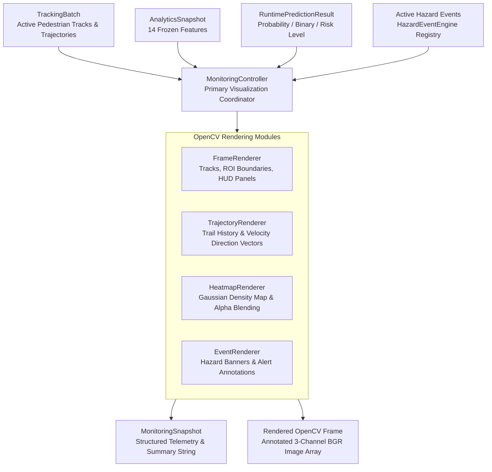

# Phase 4F: BHID Visualization & Visual Monitoring Specification

## Executive Summary

Phase 4F establishes the local visual monitoring, scene rendering, risk overlay, trajectory rendering, density heatmap generation, and operator telemetry layer of the **Bottleneck Hazard and Intelligence Detection (BHID)** system. It transforms raw tracking batches, crowd analytics snapshots, prediction probabilities, and hazard events into annotated OpenCV video frames and structured operator telemetry snapshots (`MonitoringSnapshot`).

---

## System Boundaries & Frozen Constraints

> [!IMPORTANT]
> **Frozen System Constraints:**
> 1. **Pure Local Visualization & Rendering:** Operates strictly on existing `TrackingBatch`, `AnalyticsSnapshot`, `RuntimePredictionResult`, and `HazardEvent` pipeline outputs.
> 2. **No Model Retraining or Schema Changes:** Model weights, model registry metadata (`model_registry.json`), target horizon (**Y30**), decision threshold (**0.60**), and the 14 spatiotemporal features remain strictly frozen.
> 3. **No External Infrastructure:** No web APIs, dashboards, or REST infrastructure are introduced in Phase 4F.
> 4. **No Predictor Bypassing:** The pipeline remains strictly sequential: `Detection → Tracking → Analytics → Feature Buffer → Predictor → Event Engine → Monitoring Controller → Visual Overlay Frame`.

---

## Visual Monitoring Architecture

---

## Risk Color Palette & BGR Color Mapping

| Risk Level | Binary Prediction | Probability Range | BGR Color Code | RGB Color Code | Visual Role |
|---|---|---|---|---|---|
| **LOW** | `0` | $$[0.0, 0.30)$$ | `(0, 200, 0)` | `(0, 200, 0)` | Normal safe crowd flow |
| **MODERATE** | `0` | $$[0.30, 0.60)$$ | `(0, 215, 255)` | `(255, 215, 0)` | Elevated density monitoring |
| **HIGH** | `1` | $$[0.60, 0.85)$$ | `(0, 140, 255)` | `(255, 140, 0)` | Bottleneck hazard predicted |
| **CRITICAL** | `1` | $$[0.85, 1.00]$$ | `(0, 0, 255)` | `(255, 0, 0)` | Severe congestion / hazard active |

---

## Component Specifications

### 1. `bhid/visualization/visual_config.py` (`VisualConfig`)
- Central styling configuration holding BGR color maps, track colors, trajectory trail lengths ($N=15$), font scales, line thickness, colormaps (`cv2.COLORMAP_JET`), and heatmap alpha blending ratios ($\alpha = 0.4$).

### 2. `bhid/visualization/frame_renderer.py` (`FrameRenderer`)
- Draws raw detections, active track bounding boxes (`cv2.rectangle`), track centroids (`cv2.circle`), spatial ROI zone boundaries (`cv2.polylines`), crowd density HUD telemetry panels, and top-right risk indicator badges.

### 3. `bhid/visualization/trajectory_renderer.py` (`TrajectoryRenderer`)
- Renders fading historical motion paths (`render_track_history`) and directional velocity vectors (`render_velocity_vectors` using `cv2.arrowedLine`).

### 4. `bhid/visualization/heatmap_renderer.py` (`HeatmapRenderer`)
- Accumulates track centroid density points, applies Gaussian spatial blurring ($\sigma = 35.0$), applies OpenCV JET colormap (`cv2.applyColorMap`), and performs alpha blending over input image frames (`cv2.addWeighted`, $\alpha = 0.4$).

### 5. `bhid/visualization/event_renderer.py` (`EventRenderer`)
- Renders operational hazard event alert cards (`draw_event_status` displaying Event ID, Risk Level, Status, Duration, Escalation Count) and screen-wide CRITICAL alert warning banners (`draw_alert_annotations`).

### 6. `bhid/visualization/monitoring_snapshot.py` (`MonitoringSnapshot`)
- Structured dataclass container summarizing per-frame operational telemetry. Exposes `to_dict()` and concise operator summary strings via `summary_string()`:
  `[FRAME 0042 | SCENE:ZONE] Peds=75 | Dens=1.50 ped/m2 | Risk=CRITICAL (88.0%) | ActiveEvents=1`.

### 7. `bhid/visualization/monitoring_controller.py` (`MonitoringController`)
- Primary visualization coordinator orchestrating frame renderers and exporting `MonitoringSnapshot` data.

### 8. `bhid/runtime/runtime_orchestrator.py`
- Method `process_monitoring_frame()`:
  - Connects `TrackingBatch → Analytics → Prediction → Event Engine → Monitoring Snapshot → Rendered OpenCV Frame`.

---

## Verification & Test Architecture

Phase 4F is verified through 5 targeted unit test modules and 1 full visual pipeline integration test module:

1. **`bhid/tests/unit/test_monitoring_snapshot.py`**: Validates snapshot field formatting, dictionary exports, and summary strings.
2. **`bhid/tests/unit/test_frame_renderer.py`**: Validates detection, track bounding box, HUD, and risk badge drawing.
3. **`bhid/tests/unit/test_heatmap_renderer.py`**: Validates density accumulation, colormap application, and alpha blending.
4. **`bhid/tests/unit/test_event_renderer.py`**: Validates active event alert cards and critical warning banners.
5. **`bhid/tests/unit/test_monitoring_controller.py`**: Validates composite frame rendering and snapshot exports.
6. **`bhid/tests/integration/test_visualization_pipeline_integration.py`**: Validates end-to-end visual execution across all BHID phases (4A - 4F):
   `Detector → Tracker → Analytics → Predictor → Event Engine → Monitoring Controller → Rendered Frame`.
