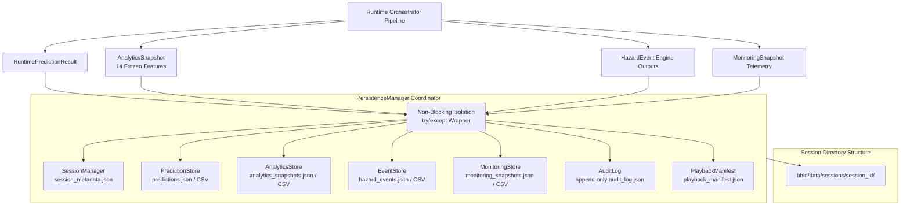

# Phase 5A: BHID Data Persistence & Historical Storage Layer Specification

## Executive Summary

Phase 5A establishes the historical data persistence, session lifecycle management, append-only operational audit logging, replay manifest indexing, and file export (JSON/CSV) layer of the **Bottleneck Hazard and Intelligence Detection (BHID)** system. It captures all operational outputs produced by the runtime pipeline—including predictions, 14-feature crowd analytics snapshots, hazard event lifecycle histories, and visual monitoring telemetry—without altering prediction behavior or blocking the main video processing pipeline.

---

## System Boundaries & Frozen Constraints

> [!IMPORTANT]
> **Frozen System Constraints:**
> 1. **Pure Local Data Persistence:** Operates strictly on existing `RuntimePredictionResult`, `AnalyticsSnapshot`, `HazardEvent`, and `MonitoringSnapshot` outputs.
> 2. **No Model Retraining or Threshold Modifications:** Model weights, model registry (`model_registry.json`), target horizon (**Y30**), decision threshold (**0.60**), and the 14 approved spatiotemporal features remain strictly frozen.
> 3. **Non-Blocking Persistence Isolation:** All disk file writes, directory creations, and batch exports in `PersistenceManager` are wrapped in non-blocking exception handlers (`try/except`). If disk writes fail (e.g. permission denied or disk full), prediction, event engine processing, and visual rendering **continue operating normally without interruption**. Disk write failures are logged as `EXPORT_ERROR` entries in `AuditLog`.
> 4. **No Deployment Infrastructure:** No cloud infrastructure, database servers, or external services are introduced.

---

## Data Persistence Architecture



---

## Directory & File Hierarchy

```text
bhid/data/sessions/{session_id}/
├── session_metadata.json              # Session metadata & summary counters
├── playback_manifest.json             # Chronological replay index
├── predictions/
│   ├── predictions.json               # Full prediction result records
│   └── predictions.csv                # Tabular prediction records
├── analytics/
│   ├── analytics_snapshots.json       # 14-feature analytics snapshots
│   └── analytics_snapshots.csv        # Tabular 14-feature matrix
├── events/
│   ├── hazard_events.json             # Hazard event lifecycle records
│   └── hazard_events.csv              # Tabular hazard event log
├── monitoring/
│   ├── monitoring_snapshots.json      # Visual telemetry snapshots
│   └── monitoring_snapshots.csv       # Tabular visual telemetry
└── audit/
    └── audit_log.json                 # Immutable append-only audit trail
```

---

## Component Specifications

### 1. `bhid/persistence/persistence_config.py` (`PersistenceConfig`)
- Configuration holding `storage_root` (`bhid/data/sessions`), session folder structure, JSON/CSV export toggles, retention limits, and folder initialization helpers.

### 2. `bhid/persistence/session_manager.py` (`SessionManager`, `SessionMetadata`)
- Manages runtime operational session lifecycles, tracks frame & event counts, records active scene/zone IDs, and writes `session_metadata.json`.

### 3. `bhid/persistence/prediction_store.py` (`PredictionStore`)
- In-memory buffer and disk exporter for `RuntimePredictionResult` records (JSON & CSV formats).

### 4. `bhid/persistence/analytics_store.py` (`AnalyticsStore`)
- Stores complete 14-feature spatiotemporal feature vectors per frame, exporting JSON and CSV tables.

### 5. `bhid/persistence/event_store.py` (`EventStore`)
- Stores `HazardEvent` records, tracking state updates (`ACTIVE`, `ESCALATED`, `RESOLVED`), escalation histories, and event durations.

### 6. `bhid/persistence/monitoring_store.py` (`MonitoringStore`)
- Stores `MonitoringSnapshot` visual telemetry records.

### 7. `bhid/persistence/audit_log.py` (`AuditLog`, `AuditEntry`)
- Append-only immutable audit trail recording system actions (`SESSION_START`, `PREDICTION_GENERATED`, `EVENT_CREATED`, `EVENT_ESCALATED`, `EVENT_RESOLVED`, `FLUSH_COMPLETED`, and `EXPORT_ERROR`).

### 8. `bhid/persistence/playback_manifest.py` (`PlaybackManifest`)
- Replay index builder linking session references, frame IDs, timestamps, prediction probabilities, risk levels, and hazard event IDs for offline playback/replay engines.

### 9. `bhid/persistence/persistence_manager.py` (`PersistenceManager`)
- Primary persistence coordinator. Wraps all disk write calls in `try/except` non-blocking handlers to ensure file I/O failures log an error audit entry instead of halting the prediction pipeline.

### 10. `bhid/runtime/runtime_orchestrator.py`
- Method `process_persistent_monitoring_frame()`:
  - Pipeline flow: `TrackingBatch → Analytics → Prediction → Hazard Events → Monitoring → Visualization → Persistence Manager`.

---

## Verification & Test Architecture

Phase 5A is verified through 5 targeted unit test modules and 1 full persistence pipeline integration test module:

1. **`bhid/tests/unit/test_session_manager.py`**: Validates session creation, duration calculation, closure, and `session_metadata.json` export.
2. **`bhid/tests/unit/test_prediction_store.py`**: Validates prediction record ingestion, JSON export, and CSV export.
3. **`bhid/tests/unit/test_event_store.py`**: Validates hazard event ingestion, state update tracking, and export integrity.
4. **`bhid/tests/unit/test_audit_log.py`**: Validates append-only immutable audit entry writing, entry retrieval, and export integrity.
5. **`bhid/tests/unit/test_persistence_manager.py`**: Validates unified persistence coordination, session flushing, and non-blocking error isolation on file write failure.
6. **`bhid/tests/integration/test_persistence_pipeline_integration.py`**: Validates complete end-to-end persistent execution across all BHID phases (4A - 5A):
   `Detection → Tracking → Analytics → Predictor → Hazard Events → Monitoring → Persistence`.
