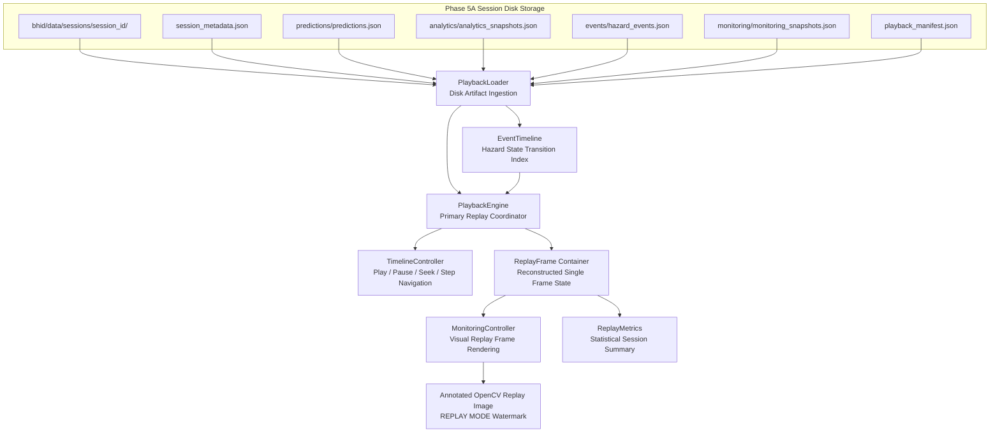

# Phase 5B: BHID Historical Playback & Replay Engine Specification

## Executive Summary

Phase 5B establishes the deterministic historical playback, replay navigation, hazard event timeline reconstruction, and offline telemetry analysis layer of the **Bottleneck Hazard and Intelligence Detection (BHID)** system. It reconstructs historical crowd analytics snapshots, prediction probabilities, hazard event lifecycle states, visual monitoring telemetry, and annotated OpenCV video frames directly from persisted Phase 5A session artifacts without re-running model inference or modifying any runtime logic.

---

## System Boundaries & Frozen Constraints

> [!IMPORTANT]
> **Frozen System Constraints:**
> 1. **Pure Historical Artifact Reconstruction:** Operates strictly on persisted Phase 5A session files (`session_metadata.json`, `predictions.json`, `analytics_snapshots.json`, `hazard_events.json`, `monitoring_snapshots.json`, `playback_manifest.json`, `audit_log.json`).
> 2. **No Model Re-Inference or Retraining:** Model weights, model registry (`model_registry.json`), target horizon (**Y30**), decision threshold (**0.60**), and the 14 approved spatiotemporal features remain strictly frozen. Replay does NOT re-run `BottleneckPredictor.predict()`.
> 3. **Deterministic Replay Guarantee:** Persisted prediction probabilities, binary hazard labels, risk levels, and 14-feature analytics vectors match original recording sessions 100% deterministically.
> 4. **No Deployment Infrastructure:** No cloud infrastructure, web servers, or external services are introduced.

---

## Historical Playback Architecture

---

## Component Specifications

### 1. `bhid/replay/replay_session.py` (`ReplaySession`)
- Dataclass container representing a loaded historical recording session (`session_id`, `scene_id`, `zone_id`, `start_timestamp`, `end_timestamp`, `total_frames`, `playback_manifest`, `duration_seconds()`).

### 2. `bhid/replay/playback_loader.py` (`PlaybackLoader`)
- Disk loader reading Phase 5A session files (`session_metadata.json`, `predictions.json`, `analytics_snapshots.json`, `hazard_events.json`, `monitoring_snapshots.json`, `playback_manifest.json`).

### 3. `bhid/replay/event_timeline.py` (`EventTimeline`)
- Reconstructs hazard-event chronology across playback timestamps, tracking event state transitions (`ACTIVE`, `ESCALATED`, `RESOLVED`) and providing timestamp-based active hazard queries (`get_active_events_at`).

### 4. `bhid/replay/replay_frame.py` (`ReplayFrame`)
- Dataclass container encapsulating single-frame reconstructed historical state (`frame_id`, `timestamp`, `monitoring_snapshot`, `active_events`, `prediction_result`, `analytics_snapshot`).

### 5. `bhid/replay/timeline_controller.py` (`TimelineController`)
- Replay navigation controller managing playback cursor position, playing/paused states, seeking (`seek`), and frame stepping (`next_frame`, `previous_frame`).

### 6. `bhid/replay/replay_metrics.py` (`ReplayMetrics`)
- Statistical aggregator computing historical session telemetry (total events, resolved events, maximum prediction probability, peak crowd density, peak pedestrian count).

### 7. `bhid/replay/playback_engine.py` (`PlaybackEngine`)
- Primary replay coordinator loading session artifacts, building chronological `ReplayFrame` lists, synchronizing event timelines, and exporting summary reports.

### 8. `bhid/visualization/monitoring_controller.py`
- Added `render_replay_frame()` and `render_replay_timeline()` reusing Phase 4F OpenCV rendering utilities with a prominent `[REPLAY MODE]` visual banner.

### 9. `bhid/runtime/runtime_orchestrator.py`
- Method `replay_historical_session()`:
  - Connects `PlaybackEngine → ReplayFrame → MonitoringController → Rendered Replay Frame`.

---

## Verification & Test Architecture

Phase 5B is verified through 5 targeted unit test modules and 1 full replay pipeline integration test module:

1. **`bhid/tests/unit/test_playback_loader.py`**: Validates loading session metadata, predictions, analytics snapshots, hazard events, and manifests from disk.
2. **`bhid/tests/unit/test_event_timeline.py`**: Validates historical event timeline indexing, active event timestamp queries, and status transition logging.
3. **`bhid/tests/unit/test_timeline_controller.py`**: Validates navigation state management (`play`, `pause`, `stop`, `seek`, `next_frame`, `previous_frame`).
4. **`bhid/tests/unit/test_replay_metrics.py`**: Validates statistical metric aggregations (peak density, peak pedestrians, max probability, total/resolved events).
5. **`bhid/tests/unit/test_playback_engine.py`**: Validates `PlaybackEngine` initialization, frame reconstruction, and summary export.
6. **`bhid/tests/integration/test_replay_pipeline_integration.py`**: Validates end-to-end replay execution across all BHID phases (4A - 5B):
   `Detector → Tracker → Analytics → Predictor → Events → Monitoring → Persistence → Replay Engine → Rendered Replay Frame`.
