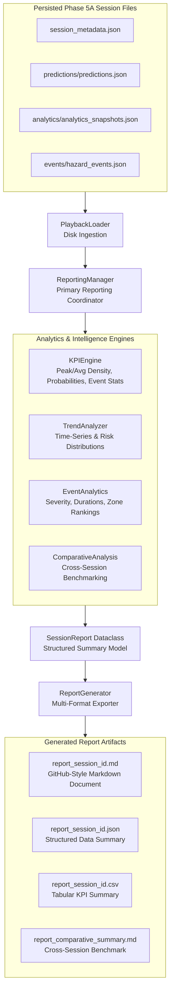

# Phase 5C: BHID Reporting & Operational Analytics Layer Specification

## Executive Summary

Phase 5C establishes the operational reporting, quantitative KPI calculation, historical trend analytics, hazard event intelligence, cross-session comparative benchmarking, and decision-support output layer of the **Bottleneck Hazard and Intelligence Detection (BHID)** system. It transforms persisted Phase 5A and Phase 5B session data into structured Markdown operational reports (`report_{session_id}.md`), JSON summaries, and CSV tables without modifying model prediction logic or introducing web server dependencies.

---

## System Boundaries & Frozen Constraints

> [!IMPORTANT]
> **Frozen System Constraints:**
> 1. **Pure Data Consumption & Reporting:** Consumes strictly existing persisted session artifacts (`session_metadata.json`, `predictions.json`, `analytics_snapshots.json`, `hazard_events.json`, `monitoring_snapshots.json`).
> 2. **No Model Retraining or Threshold Modifications:** Model weights, model registry (`model_registry.json`), target horizon (**Y30**), decision threshold (**0.60**), and the 14 approved spatiotemporal features remain strictly frozen.
> 3. **Deterministic Output:** Computed KPIs, trend statistics, hazard event intelligence, and spatial rankings match persisted session records 100% deterministically.
> 4. **No Deployment Infrastructure:** No cloud services, web frontends, REST APIs, or database servers are introduced. Output is generated as local Markdown, JSON, and CSV files.

---

## Reporting Architecture



---

## Output File Directory Structure

```text
bhid/reports/
├── report_{session_id}.md              # GitHub-style Markdown operational report
├── report_{session_id}.json            # JSON operational intelligence report
├── report_{session_id}.csv             # Tabular KPI summary table
└── report_comparative_summary.md       # Multi-session comparative benchmark report
```

---

## Component Specifications

### 1. `bhid/reporting/report_config.py` (`ReportConfig`)
- Configuration holding output directory path (`bhid/reports`), multi-format export toggles (JSON, CSV, Markdown), timestamp format strings, and path generator helpers.

### 2. `bhid/reporting/kpi_engine.py` (`KPIEngine`)
- Computes quantitative operational KPIs:
  - Peak and average crowd density ($\text{ped/m}^2$).
  - Peak and average pedestrian counts.
  - Peak and average bottleneck hazard prediction probabilities ($Y_{30}$).
  - Total hazard event counts, resolved hazard event counts, resolution rate percentage, and average event duration.

### 3. `bhid/reporting/trend_analyzer.py` (`TrendAnalyzer`)
- Extracts chronological time-series (density, inflow/outflow/net flow rates, occupancy ratio, risk probability) and computes categorical risk level distributions (`LOW`, `MODERATE`, `HIGH`, `CRITICAL`).

### 4. `bhid/reporting/event_analytics.py` (`EventAnalytics`)
- Analyzes hazard event severity breakdowns, escalation statistics, event duration ranges, and spatial zone risk rankings (sorted by critical event frequency and maximum risk probability).

### 5. `bhid/reporting/session_report.py` (`SessionReport`)
- Structured dataclass container storing aggregated KPI, trend, and event summaries. Generates GitHub-style Markdown documents (`to_markdown()`) complete with alert callouts and formatted markdown tables.

### 6. `bhid/reporting/comparative_analysis.py` (`ComparativeAnalysis`)
- Performs multi-session benchmarking, comparative risk profiling, and peak operational session identification across multiple historical recording sessions.

### 7. `bhid/reporting/report_generator.py` (`ReportGenerator`)
- Multi-format exporter writing structured JSON files, CSV tables, and Markdown documents to disk.

### 8. `bhid/reporting/reporting_manager.py` (`ReportingManager`)
- Primary operational coordinator orchestrating data loading, KPI calculation, trend analysis, event intelligence, comparative benchmarking, and file exports.

### 9. `bhid/runtime/runtime_orchestrator.py`
- Method `generate_operational_report()`:
  - Connects `ReportingManager → KPIEngine → SessionReport → ReportGenerator → Markdown / JSON / CSV Files`.

---

## Verification & Test Architecture

Phase 5C is verified through 5 targeted unit test modules and 1 full reporting pipeline integration test module:

1. **`bhid/tests/unit/test_kpi_engine.py`**: Validates KPI computations (peak/average density, pedestrian counts, hazard event metrics, probabilities).
2. **`bhid/tests/unit/test_trend_analyzer.py`**: Validates chronological density/flow/risk distribution trends.
3. **`bhid/tests/unit/test_event_analytics.py`**: Validates hazard event intelligence, escalation frequencies, duration statistics, and zone risk rankings.
4. **`bhid/tests/unit/test_comparative_analysis.py`**: Validates multi-session benchmarking, comparative risk profiling, and peak session identification.
5. **`bhid/tests/unit/test_reporting_manager.py`**: Validates unified report generation and multi-format exports (JSON, CSV, Markdown).
6. **`bhid/tests/integration/test_reporting_pipeline_integration.py`**: Validates end-to-end operational reporting execution across all BHID phases (4A - 5C):
   `Detector → Tracker → Analytics → Predictor → Events → Monitoring → Persistence → Reporting Manager → Reports`.
