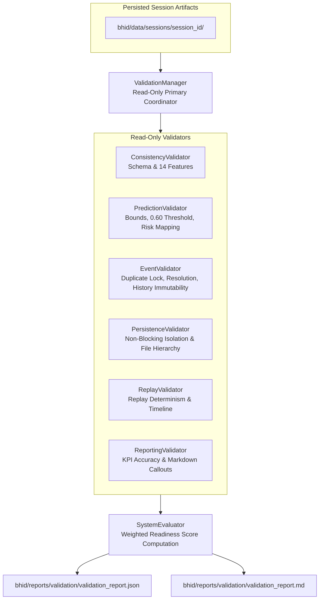

# Phase 5D: BHID Operational Validation & System Evaluation Specification

## Executive Summary

Phase 5D establishes the comprehensive read-only operational validation, cross-phase schema consistency checking, prediction integrity auditing, event lifecycle verification, persistence/replay determinism checking, reporting accuracy validation, and operational readiness scoring ($0.0 \dots 100.0\%$) layer of the **Bottleneck Hazard and Intelligence Detection (BHID)** system.

All validators operate in **strictly read-only mode** without re-running model inference, retraining models, modifying feature schemas, altering prediction thresholds, or mutating stored session artifacts.

---

## System Boundaries & Frozen Constraints

> [!IMPORTANT]
> **Frozen System Constraints:**
> 1. **Strictly Read-Only Operations:** No validator modifies sessions, reports, hazard events, or stored artifacts.
> 2. **Zero Model Re-Inference:** `PredictionValidator` validates persisted prediction records (probability bounds, decision thresholds, binary labels, risk mappings) without calling `BottleneckPredictor.predict()` again.
> 3. **Replay Validation via Phase 5B Artifacts:** Compares replayed `ReplayFrame` objects against persisted Phase 5A records without regenerating analytics or predictions.
> 4. **Explicit Readiness Score Formula:** Readiness scores use explicit component weights ($w_c$) summing to $1.0$, preventing arbitrary percentage assignments.
> 5. **Exported Validation Artifacts:** Exports `validation_report.json` and `validation_report.md` to `bhid/reports/validation/`.

---

## Operational Readiness Score Formula

$$\text{Readiness Score} = \sum_{c} w_c \times S_c$$

where component score $S_c \in [0.0, 100.0]$ and weights $w_c$ are defined as:

| Validation Component | Weight ($w_c$) | Scope & Description |
|---|---|---|
| **Schema Consistency** | `0.15` | Validates 14 frozen features, prediction schemas, and event fields |
| **Prediction Integrity** | `0.20` | Validates bounds $[0,1]$, threshold $0.60$, and 4-tier risk level mapping |
| **Event Lifecycle** | `0.20` | Validates duplicate suppression, resolution timestamps, and history immutability |
| **Persistence Isolation** | `0.15` | Validates non-blocking isolation architecture and directory structure |
| **Replay Determinism** | `0.15` | Validates 100% equivalence between persisted records and replayed frames |
| **Reporting Accuracy** | `0.15` | Validates report KPIs and Markdown formatting against source data |

### System Health Status Criteria
- **`PASSED`**: Readiness Score $\ge 95.0\%$ AND all individual components passed ($S_c = 100.0$). System is certified for release readiness.
- **`WARNING`**: Readiness Score $\ge 80.0\%$ but $< 95.0\%$. Requires operational review.
- **`FAILED`**: Readiness Score $< 80.0\%$ or critical schema failure. System requires remediation.

---

## Validation Architecture

---

## Component Specifications

### 1. `bhid/validation/validation_config.py` (`ValidationConfig`)
- Configuration holding output directory (`bhid/reports/validation`), tolerance parameters (0.0), readiness pass threshold ($95.0\%$), and component weights dictionary.

### 2. `bhid/validation/consistency_validator.py` (`ConsistencyValidator`)
- Read-only schema validator verifying interface compatibility across Detection Batch, Tracking Batch, Analytics 14-feature vectors, Predictions, and Hazard Events.

### 3. `bhid/validation/prediction_validator.py` (`PredictionValidator`)
- Read-only prediction validator verifying probability bounds ($[0,1]$), $0.60$ decision threshold enforcement, and 4-tier risk level mapping (`LOW`, `MODERATE`, `HIGH`, `CRITICAL`).

### 4. `bhid/validation/event_validator.py` (`EventValidator`)
- Read-only hazard event validator verifying active duplicate event locks per zone, resolution timestamp logic, escalation counts, and prediction history immutability.

### 5. `bhid/validation/persistence_validator.py` (`PersistenceValidator`)
- Read-only persistence validator verifying non-blocking exception isolation architecture, folder hierarchy completeness, and audit log append immutability.

### 6. `bhid/validation/replay_validator.py` (`ReplayValidator`)
- Read-only replay validator verifying 100% prediction determinism between replayed `ReplayFrame` instances and persisted session records.

### 7. `bhid/validation/reporting_validator.py` (`ReportingValidator`)
- Read-only reporting validator verifying report KPI accuracy against source data and Markdown report document formatting.

### 8. `bhid/validation/system_evaluator.py` (`SystemEvaluator`)
- Readiness scoring engine evaluating the weighted formula $\sum w_c S_c$ and assigning overall health status (`PASSED`, `WARNING`, `FAILED`).

### 9. `bhid/validation/validation_manager.py` (`ValidationManager`)
- Read-only primary operational coordinator executing all validation modules, invoking `SystemEvaluator`, and exporting `validation_report.json` and `validation_report.md`.

### 10. `bhid/runtime/runtime_orchestrator.py`
- Methods `run_system_validation()` and `generate_validation_report()`.

---

## Verification & Test Architecture

Phase 5D is verified through 7 targeted unit test modules and 1 full system validation integration test module:

1. **`test_consistency_validator.py`**: Validates schema consistency checks across all pipeline interfaces.
2. **`test_prediction_validator.py`**: Validates probability bounds, threshold enforcement, and risk level mapping.
3. **`test_event_validator.py`**: Validates duplicate suppression, resolution thresholds, and history immutability.
4. **`test_persistence_validator.py`**: Validates directory structure and non-blocking error isolation.
5. **`test_replay_validator.py`**: Validates historical replay prediction determinism.
6. **`test_reporting_validator.py`**: Validates report KPI precision against ground truth session records.
7. **`test_validation_manager.py`**: Validates unified validation execution, readiness score calculation, and file exports.
8. **`test_system_validation_integration.py`**: Validates end-to-end system evaluation across all BHID phases (4A - 5D).
