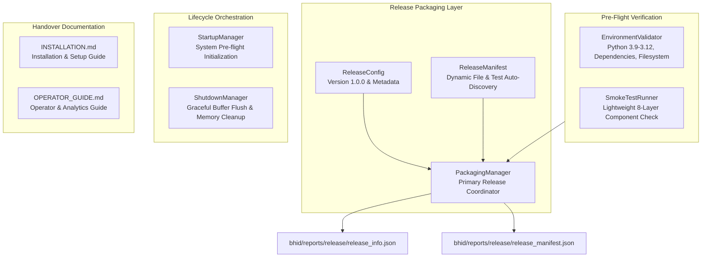

# Phase 6A: BHID System Packaging & Release Readiness Specification

## Executive Summary

Phase 6A establishes the platform release packaging, pre-flight environment validation, component smoke testing, graceful startup/shutdown orchestration, dynamic release manifest auto-discovery, system installation guide (`INSTALLATION.md`), and operator manual (`OPERATOR_GUIDE.md`) layer of the **Bottleneck Hazard and Intelligence Detection (BHID)** system v1.0.

All packaging and verification operations operate strictly within dedicated release directories (`bhid/reports/release`) without modifying model inference logic, changing decision thresholds, or mutating operational session data.

---

## System Boundaries & Frozen Constraints

> [!IMPORTANT]
> **Frozen System Constraints:**
> 1. **Zero Model Retraining or Inference Modification:** Model weights, model registry (`model_registry.json`), target horizon (**Y30**), decision threshold (**0.60**), and the 14 approved spatiotemporal features remain strictly frozen.
> 2. **No Alteration of Existing Runtime Execution Paths:** `RuntimeOrchestrator` methods `initialize_bhid()`, `shutdown_bhid()`, and `run_release_verification()` are added purely as new release entrypoints.
> 3. **Non-Fatal Structured Environment Validation:** `EnvironmentValidator` returns structured result dictionaries without throwing immediate unhandled exceptions.
> 4. **Lightweight Non-Mutating Smoke Tests:** `SmokeTestRunner` verifies component instantiation across all 8 platform layers without retraining models or regenerating persisted session data.
> 5. **Dynamic Manifest Auto-Discovery:** `ReleaseManifest` auto-discovers Python source modules, unit/integration test suites, and Markdown documentation files dynamically.
> 6. **Dedicated Release Artifact Directory:** All release artifacts (`release_info.json`, `release_manifest.json`) are exported strictly into `bhid/reports/release/`.

---

## Release Architecture

---

## Component Specifications

### 1. `bhid/release/release_config.py` (`ReleaseConfig`)
- Release metadata container holding system name ("BHID - Bottleneck Hazard & Intelligence Detection"), version ("1.0.0"), release type ("STABLE_RELEASE"), build timestamp, supported Python versions, minimum dependency specifications, and path resolution helpers.

### 2. `bhid/release/environment_validator.py` (`EnvironmentValidator`)
- Pre-flight runtime environment validator performing non-fatal checks on Python version compatibility, library availability (`numpy`, `pandas`, `cv2`, `lightgbm`, `xgboost`, `sklearn`, `scipy`), `model_registry.json` existence, directory structures, and write permissions.

### 3. `bhid/release/startup_manager.py` (`StartupManager`)
- System startup orchestrator executing pre-flight environment checks, platform package imports, configuration loading, and startup health reporting.

### 4. `bhid/release/shutdown_manager.py` (`ShutdownManager`)
- Graceful shutdown orchestrator closing active session records, flushing pending persistence exports non-blockingly, and cleaning transient memory state.

### 5. `bhid/release/release_manifest.py` (`ReleaseManifest`)
- Dynamic release manifest builder auto-discovering Python source modules, test files, and Markdown documentation files to generate `release_manifest.json`.

### 6. `bhid/release/smoke_test_runner.py` (`SmokeTestRunner`)
- Verification suite executing fast, lightweight instantiation checks across all 8 platform layers (Analytics, Predictor loading, Event Engine, Visualization, Persistence, Replay, Reporting, Validation).

### 7. `bhid/release/packaging_manager.py` (`PackagingManager`)
- Primary release coordinator running pre-release checks, building release bundles, and exporting artifacts into `bhid/reports/release/`.

### 8. Handover Guides (`INSTALLATION.md` & `OPERATOR_GUIDE.md`)
- Complete installation, dependency setup, model verification, monitoring workflow, replay workflow, reporting workflow, validation workflow, and shutdown guides.

---

## Verification & Test Architecture

Phase 6A is verified through 5 targeted unit test modules and 1 full release pipeline integration test module:

1. **`test_environment_validator.py`**: Validates Python version checks, package availability checks, and filesystem checks.
2. **`test_startup_manager.py`**: Validates startup initialization sequence and component verification.
3. **`test_shutdown_manager.py`**: Validates graceful shutdown and non-blocking export flushes.
4. **`test_smoke_test_runner.py`**: Validates lightweight smoke test execution across all 8 platform layers.
5. **`test_packaging_manager.py`**: Validates release bundle generation and manifest exports into `bhid/reports/release/`.
6. **`test_release_pipeline_integration.py`**: Validates end-to-end release readiness execution across all BHID phases (1 - 6A).
