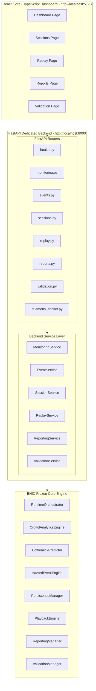

# Phase 7A: Web Platform Transformation Architecture Specification

## Executive Summary

Phase 7A transforms the existing headless BHID v1.0 engine into a full-stack localhost web application. By introducing a dedicated FastAPI REST API & WebSocket backend (`backend/`) and a React/Vite/TypeScript frontend dashboard (`frontend/`), BHID capabilities are accessible directly through a modern web browser while preserving all existing frozen analytics, prediction, event management, persistence, replay, reporting, validation, and release logic.

---

## Architectural Pattern: Router → Service → BHID Core Engine

---

## System Boundaries & Frozen Constraints

> [!IMPORTANT]
> **Frozen System Boundaries:**
> 1. **Zero Prediction Logic Modification:** `BottleneckPredictor`, `model_registry.json`, $Y_{30}$ horizon, decision threshold ($0.60$), and 14 approved spatiotemporal features remain strictly frozen.
> 2. **Decoupled Service Layer (`Router → Service → BHID Core`):** All API endpoints delegate business logic to services in `backend/services/`.
> 3. **Non-Blocking Telemetry Streaming:** `/ws/telemetry` streams live 2.5Hz crowd density and hazard probability without blocking HTTP router endpoints.
